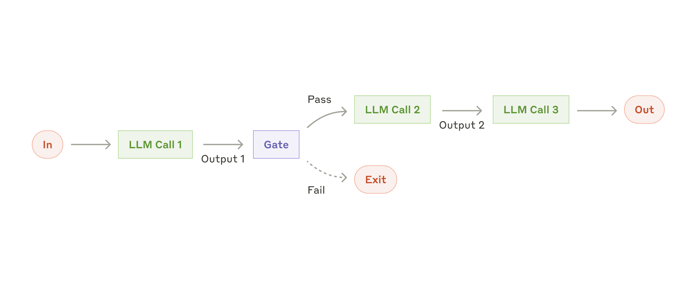
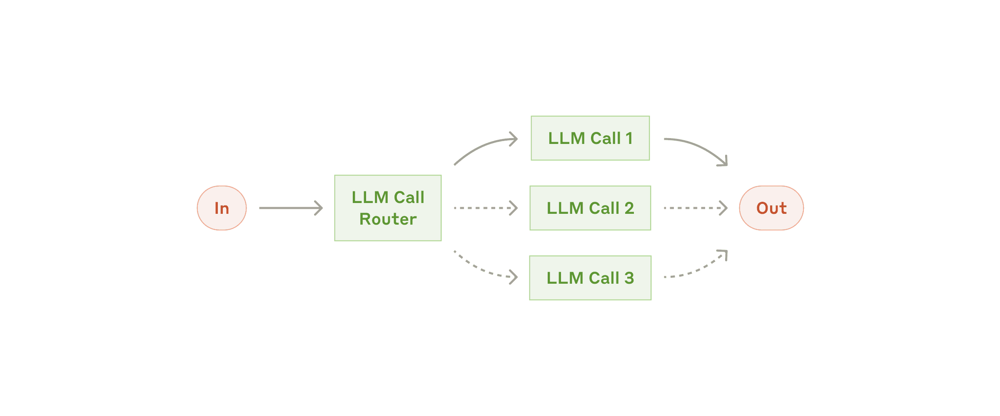
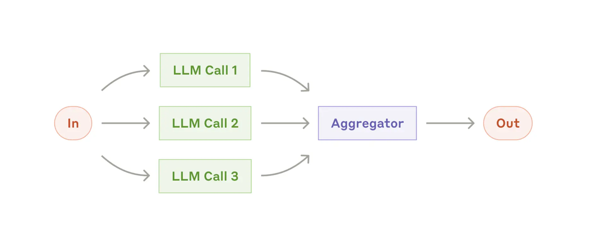
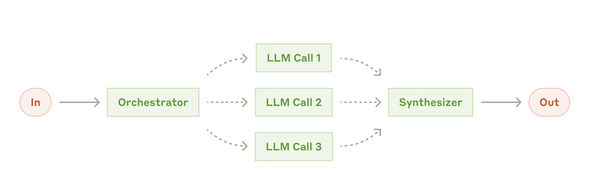
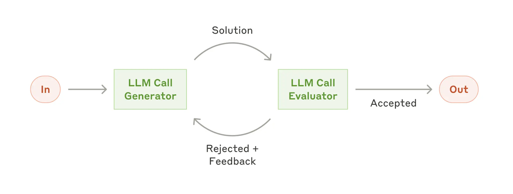
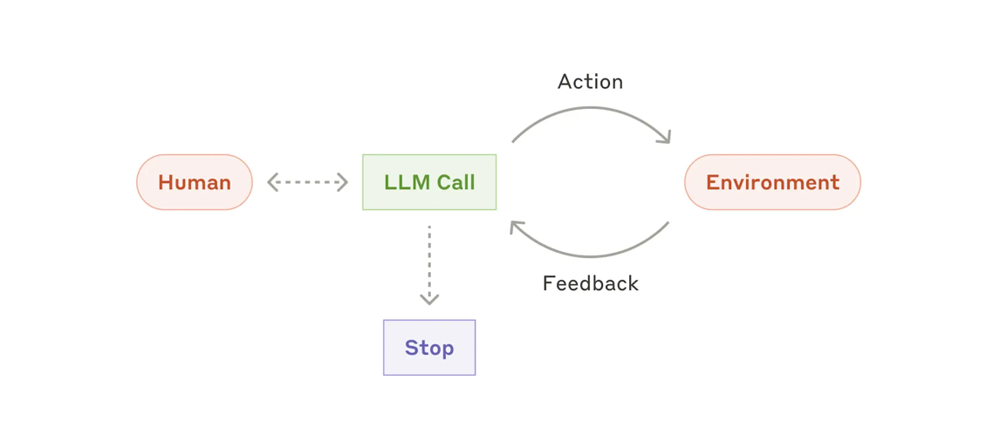
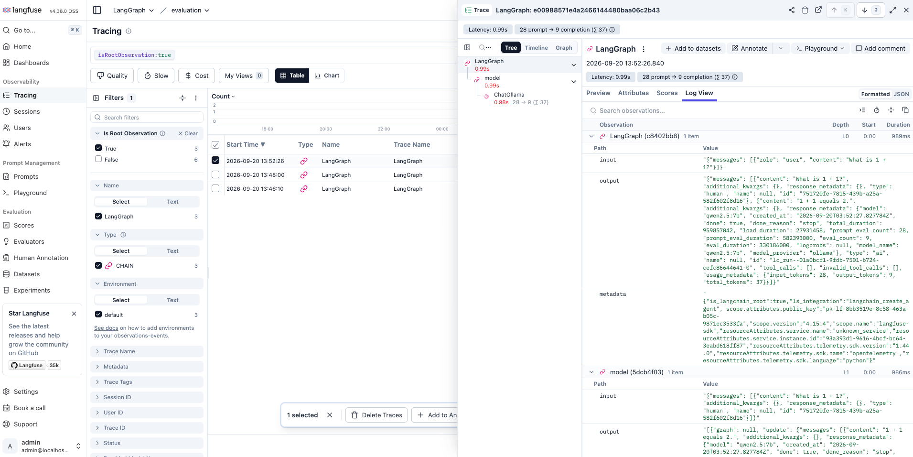
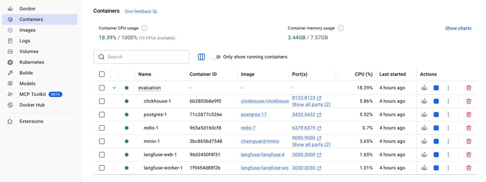
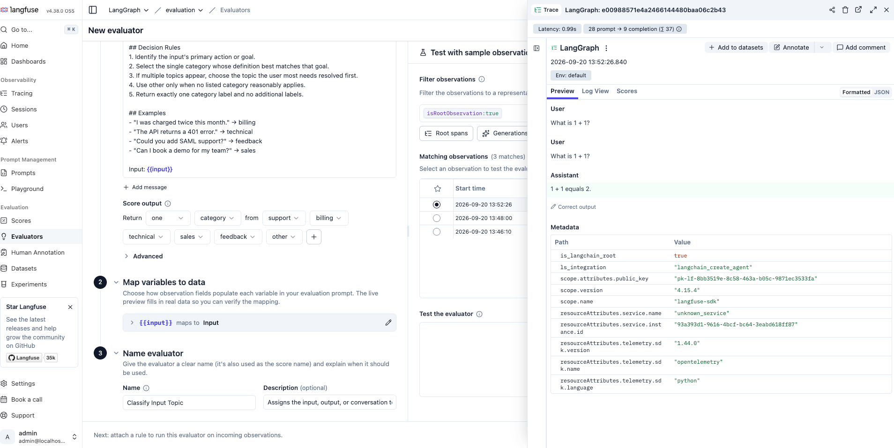

# LangGraph Building Blocks

Patterns from [Building effective agents](https://www.anthropic.com/engineering/building-effective-agents). Local model: Ollama `qwen2.5:7b`.

---

## `prompt_chaining.py`

**Topic:** Prompt Chaining

**Key techniques:**
- `StateGraph` + `TypedDict` for shared state
- Linear edges: `START → outline → draft → paper → END`
- Each step feeds the next (outline → draft → polish)

<p></p>

---

## `routing.py`

**Topic:** Routing

**Key techniques:**
- LLM classifies first, then the graph takes a branch
- `add_conditional_edges` + routing function `selectFaction`
- Same input is sent to a specialist node (Confucianism / Legalism / Taoism)

<p></p>

---

## `parallelization.py`

**Topic:** Parallelization

**Key techniques:**
- Fan-out from `START` to multiple nodes at once
- Fan-in with `add_edge(["nodeA", "nodeB"], next_node)` so the next node waits for both
- `Annotated[int, reducer]` merges concurrent writes to the same field (`max` on `receiveDate`)

<p></p>

---

## `orchestrator_workers.py`

**Topic:** Orchestrator-Workers

**Key techniques:**
- Orchestrator plans work: `with_structured_output` + Pydantic chapter list
- `Send("work", {...})` fans out workers dynamically per chapter
- Separate `WorkerState`; `Annotated[list, operator.add]` aggregates parallel results
- Synthesizer sorts by chapter number and joins them into one novel

<p></p>

---

## `evaluator_optimizer.py`

**Topic:** Evaluator-Optimizer

**Key techniques:**
- Generate → Evaluate → if rejected, generate again with feedback
- `add_conditional_edges`: `accept → END`, `reject → generate`
- JSON-constrained evaluator output (`Qualified` / `Revision Suggestions`)
- `count >= 5` as a max-iteration guard

<p></p>

---

## `langchain_agent_tool_calling.py`

**Topic:** Agent + Tool Calling

**Key techniques:**
- `create_agent` lets the model decide whether and which tool to call
- Plain Python functions as tools (name + docstring = tool spec)
- Multi-tool use: `getTrainSchedule` and `getAvailableHotel`

<p></p>

---

## `langfuse_monitor_debug_evaluation.py`

**Topic:** Langfuse Monitoring / Debug / Evaluation

how to run it:
```bash
cd milvus_redis
docker compose up -d
```
- http://localhost:3000/ 

When you are finished, shut the stack down from the same directory:

```bash
cd milvus_redis
docker compose down
```

**Key techniques:**
- `langfuse.langchain.CallbackHandler` reports LangChain/Agent calls as traces
- Loads `LANGFUSE_PUBLIC_KEY` / `LANGFUSE_SECRET_KEY` / `LANGFUSE_BASE_URL` from `evaluation/.env`
- `get_client().flush()` + `shutdown()` so a short script exports events before exit
- Inspect latency, inputs, and outputs in the local Langfuse UI (`http://localhost:3000`)

<p></p>

### `evaluation`

**Topic:** Self-hosted Langfuse (observability + evaluation)

**Key techniques:**
- Docker Compose brings up the full stack
- Components:
  - `langfuse-web`: UI / API on port `3000`
  - `langfuse-worker`: ingestion and evaluation jobs
  - `postgres`: application metadata
  - `clickhouse`: trace / observation analytics
  - `redis`: queues
  - `minio`: S3-compatible storage for events / media
- `.env` initializes org / project / API keys for the Python SDK
- Used for trace debugging, dataset evals, LLM-as-a-Judge, and experiment comparison
<p></p>

<p></p>
```